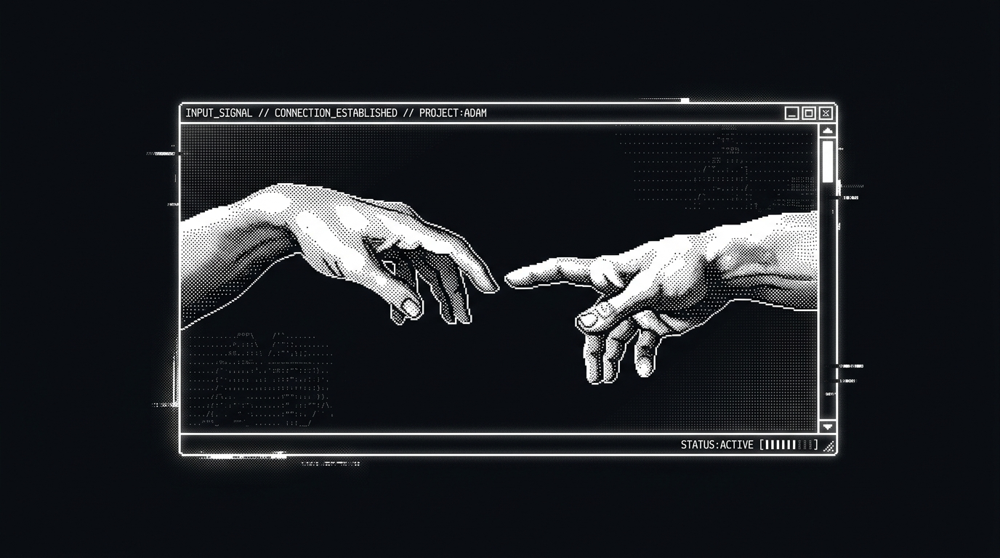

<!--
  ==============================================================
  SANDESH ANVEKAR — GITHUB PROFILE README
  Aesthetic: Cyber-Retro & Dithered Sci-Fi Terminal
  Identity: AI Product Engineer & Full-Stack Builder / Founder
  ==============================================================
-->

  

<h1 align="center">Hi 👋, I'm Sandesh Anvekar</h1>

<h3 align="center">AI Product Engineer &amp; Full-Stack Builder</h3>

  

  <code>&gt; CS &amp; AI/ML @ NIAT Pune • Full-stack + GenAI • Building from 0 to 1 &lt;</code>

  <em>Building intelligent AI products, agentic workflows, and scalable systems with clean architecture.</em>

 

<!-- ============================================================== -->
<!-- ABOUT ME SECTION                                               -->
<!-- ============================================================== -->

<h2 align="center">🚀 About Me</h2>

<table border="0" width="100%">
  <tr>
    <td width="66%" valign="top">
      

        👋 <b>Sandesh, Here</b> — a Computer Science &amp; AI/ML undergraduate at <b>NIAT Pune</b> focused on engineering intelligence and shipping production-ready web applications.
      

      

        🚀 I enjoy building scalable, 0-to-1 AI products and startup tools. Obsessed with fast execution, clean system architecture, pixel-perfect UX, and creating software that lasts.
      

      

        ⚡ Currently building and exploring <b>Autonomous LLM Agents</b>, <b>Computer Vision</b>, <b>FastAPI</b>, <b>Next.js</b>, <b>Docker</b>, and <b>Vector Databases</b>, while sharpening my problem-solving skills through Data Structures &amp; Algorithms.
      

      

        🎯 <b>My goal is simple:</b> write clean code, build reliable software, and grow into a world-class engineer who creates systems that matter.
      

    </td>
    <td width="34%" align="center" valign="middle">
      
    </td>
  </tr>
</table>

 

<!-- ============================================================== -->
<!-- CONNECT SECTION                                                -->
<!-- ============================================================== -->

<h2 align="center">🤝 Connect With Me</h2>

  
  &nbsp;&nbsp;
  
  &nbsp;&nbsp;
  
  &nbsp;&nbsp;
  

 

<!-- ============================================================== -->
<!-- FEATURED PROJECTS SHOWCASE                                     -->
<!-- ============================================================== -->

<h2 align="center">🛠️ Featured Projects</h2>

<table width="100%">
  <thead>
    <tr>
      <th width="32%" align="left">Project</th>
      <th width="48%" align="left">Description</th>
      <th width="20%" align="center">Stack &amp; Repository</th>
    </tr>
  </thead>
  <tbody>
    <tr>
      <td>
        <b>🤖 <a href="https://github.com/sandesh-anvekar/RetroVisionAI">RetroVisionAI</a></b>
      </td>
      <td>
        AI-powered computer vision &amp; visual intelligence platform for image analysis and creative synthesis.
      </td>
      <td align="center">
        <code>TypeScript</code> <code>AI/ML</code> 
        <a href="https://github.com/sandesh-anvekar/RetroVisionAI"><b>View Repository →</b></a>
      </td>
    </tr>
    <tr>
      <td>
        <b>🎙️ <a href="https://github.com/sandesh-anvekar/founder-voice">founder-voice</a></b>
      </td>
      <td>
        Voice-first intelligence system and agentic assistant tailored for fast-moving startup founders.
      </td>
      <td align="center">
        <code>TypeScript</code> <code>Next.js</code> 
        <a href="https://github.com/sandesh-anvekar/founder-voice"><b>View Repository →</b></a>
      </td>
    </tr>
    <tr>
      <td>
        <b>⚡ <a href="https://github.com/sandesh-anvekar/Solo-Leveling-Inspired-App">Solo-Leveling-App</a></b>
      </td>
      <td>
        Gamified productivity, habit and quest tracking application inspired by the Solo Leveling hunter system.
      </td>
      <td align="center">
        <code>TypeScript</code> <code>React</code> 
        <a href="https://github.com/sandesh-anvekar/Solo-Leveling-Inspired-App"><b>View Repository →</b></a>
      </td>
    </tr>
  </tbody>
</table>

 

<!-- ============================================================== -->
<!-- TECH STACK & TOOLS                                             -->
<!-- ============================================================== -->

<h2 align="center">💻 Tech Stack &amp; Tools</h2>

  

 

<!-- ============================================================== -->
<!-- GITHUB STATS & TELEMETRY                                       -->
<!-- ============================================================== -->

<h2 align="center">📊 GitHub Stats &amp; Telemetry</h2>

  

  
  &nbsp;&nbsp;
  

 

<!-- ============================================================== -->
<!-- FOOTER & TELEMETRY                                             -->
<!-- ============================================================== -->

  

  <i>"Any sufficiently advanced technology is indistinguishable from magic." — Arthur C. Clarke</i>

  Engineered with ⚡ by <b><a href="https://github.com/sandesh-anvekar">Sandesh Anvekar</a></b>

